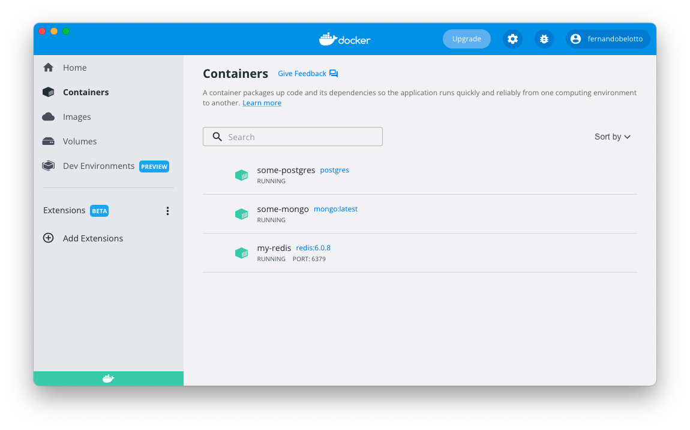
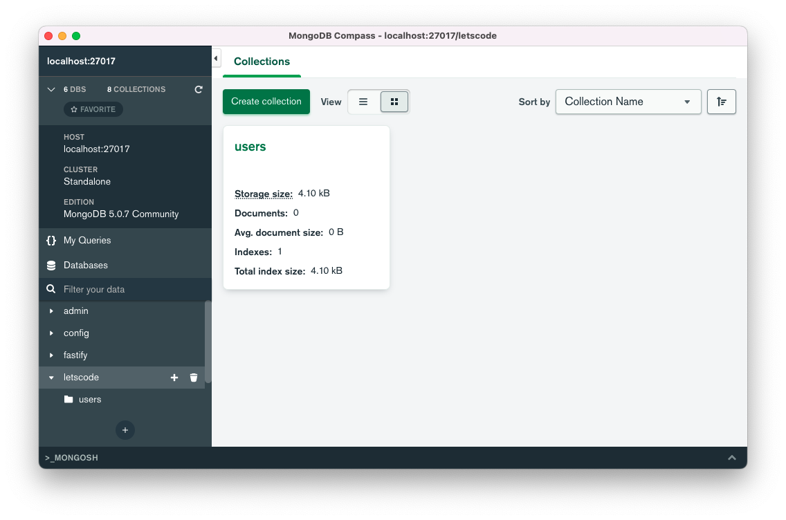
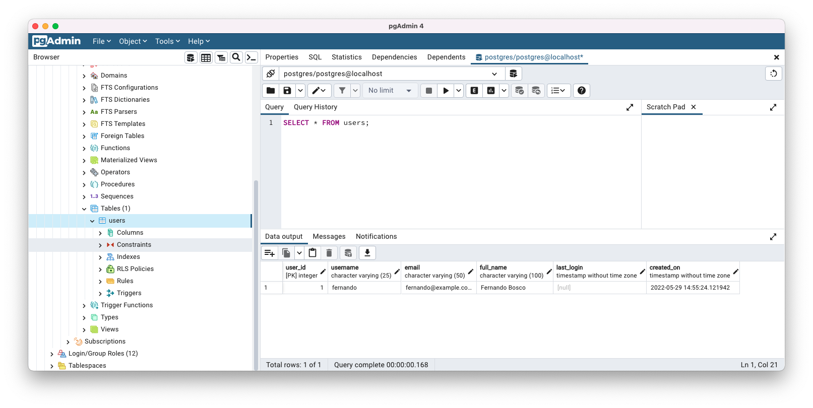
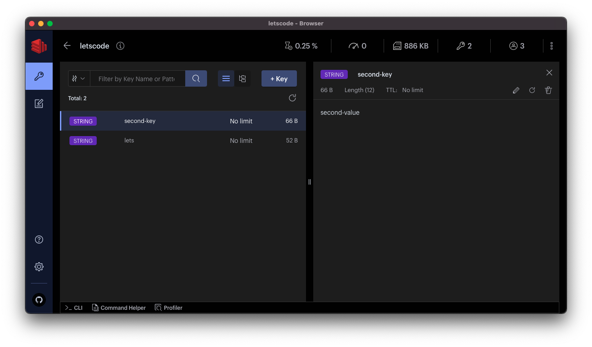

# Conectando nodejs ao postgres, redis e mongodb

Em cada pasta você encontra readme.md que contém um passo a passo rápido para conseguir ter as databases funcionando no seu computador para que podemos testar nosso script pequeno.

Para cada exemplo você vai precisar instalar o docker, você pode instalar ele no seguinte link
-  https://www.docker.com/get-started

## Screenshots dos softwares

